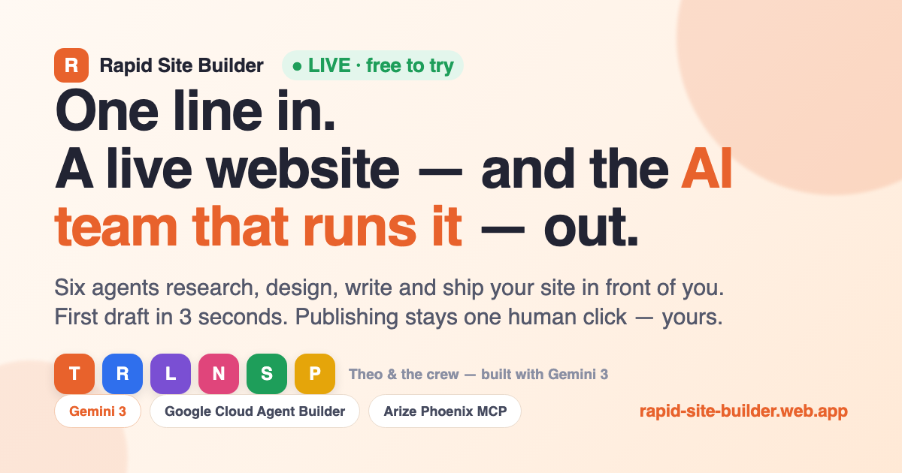

# ⚡ Rapid Site Builder

**Describe your business in one line — an AI agent team designs, writes, and ships your website in front of you. Then it stays to run it.**

**[⚡ Try it live — free](https://rapid-site-builder.web.app)** · **[🎥 3-minute demo](https://www.youtube.com/watch?v=MhyCTNXyjHc)** · **[🏆 Devpost entry](https://devpost.com/software/rapid-site-builder-hire-your-ai-ops-team)**



Built for the Google Cloud Rapid Agent Hackathon (Arize track). Submitted state: tag [`devpost-submission`](../../releases/tag/devpost-submission). **Development continues on the `real-app` branch, not on `main` — see [Branches & surfaces](#branches--surfaces) before concluding a feature is missing.** Google-native end to end:

- **Google Cloud Agent Builder (ADK)** — an eight-specialist crew orchestrated by `site_builder_orchestrator`, deployed on **Vertex AI Agent Engine**. The design trio — Dana (UX flow) · Remy (visual system) · Kai (frontend checks) — joins the build conversation once the serving engine carries them (`BUILDER_DESIGN_TRIO=1`).
- **Gemini 3** for every agent turn (`gemini-3-flash-preview`, routed to the global Vertex endpoint from inside the pickled crew), plus **Nano Banana Pro (`gemini-3-pro-image-preview`)** for hero photography (GCS-cached by business category)
- **Arize Phoenix MCP** (partner integration) — the observability agent records every build run through Phoenix's MCP server
- No other AI anywhere.

## Branches & surfaces

This repo ships **two live surfaces from two branches**, deliberately. They are diverged and stay diverged.

| surface | branch | deploy workflow | Cloud Run service | Hosting site | auth |
|---|---|---|---|---|---|
| **Hackathon demo** (frozen) | `main` | `deploy.yml` — on push | `rapid-builder-proxy` | `rapid-site-builder.web.app` | **off** |
| **Real app** (the product) | `real-app` | `deploy-realapp.yml` — manual dispatch | `rapid-builder-app` | `rapid-site-builder-app.web.app` | **on** |

`main` is the Devpost demo: no login, anyone can build and publish. `real-app` is where the product is
built — accounts, `ownerUid`-scoped sites, the post-login operate board — and it is the branch that
carries ongoing work. Each surface has its own CI too: `preview.yml` gates PRs into `main`,
`ci-realapp.yml` gates PRs into `real-app`.

> **The consequence worth stating outright: a feature can be live in production and absent from `main`,
> and that is by design.** Reading `main`'s tree or its commit history answers "is this on the hackathon
> demo?", never "was this ever built". Check the branch the feature belongs to — post-login work is
> always `real-app`.
>
> This is not hypothetical. P2b (operate-board media upload) merged to `real-app` as PR #39 in July and
> has served in production since; because `lib/p2b-media.js` does not exist on `main`, a later review
> read `main` alone and concluded it had "never been built", sending a finished ticket back to the
> backlog. The next reader would have rebuilt shipped code.

Nothing crosses over implicitly: the two deploy paths target different services and different Hosting
sites, so a push to `main` cannot change the real-app surface, and vice versa.

## The experience

1. **Intake (~30 seconds, no login):** business name · category · one line about it · optional vibe.
2. **The agents show:** the crew streams live — Brief researches, Leo lays out, Noa writes, Sam scores SEO, Phoenix traces the run to Arize — every real `function_call` visible.
3. **The payoff:** a polished one-page site renders in an inline preview.
4. **Publish — free:** one click ships it to a real shareable URL (`/sites/{id}`), server-side rendered.
5. **The operate board:** the client lands with **Theo the orchestrator** front and center — the team now *runs* the site (monitoring, updates, security). The client never has to do anything; they can talk to Theo only when they wish ("Ask the team" sends a real turn to the live Agent Engine), and the rare decision arrives as a single calm approval.

## Architecture

```
web/                 static frontend (landing show + operate board)
server.js            Express on Cloud Run — SSE /api/build, /api/publish, /sites/:id, /api/ask
lib/engine.js        Vertex AI Agent Engine driver (create_session + phased stream_query,
                     incremental SSE — one ADK turn ends at the first agent transfer)
lib/renderer.js      deterministic site renderer (4 layouts × 5 vibe palettes, no scripts)
lib/images.js        Gemini image gen + GCS cache keyed by category/style (recyclable art)
lib/store.js         published sites in GCS, served at /sites/:id
agents/              the ADK crew source (google-adk) + deterministic tools
scripts/deploy_agent_engine.py   deploys the crew to Vertex AI Agent Engine
```

Human-in-the-loop by design: the crew only drafts; the **only** way a site goes live is the human clicking Publish.

## Run it yourself

Prereqs: a GCP project with Vertex AI enabled, two GCS buckets (one public-read for the image cache, one private for published sites), and ADC (`gcloud auth login`).

```bash
# 1. Deploy the agent crew to Vertex AI Agent Engine
pip install -r agents/requirements.txt
GOOGLE_CLOUD_PROJECT=<project> AGENT_ENGINE_STAGING_BUCKET=gs://<staging-bucket> \
  python scripts/deploy_agent_engine.py
# → prints RESOURCE_NAME=projects/.../reasoningEngines/...
# NOTE: every run mints a NEW engine — pin the printed resource, don't
# recreate. Lifecycle + audit + prune runbook: docs/ENGINES.md

# 2. Configure + run the app
cp .env.example .env   # fill in the resource name + buckets + image project
npm install
node server.js         # http://localhost:8080

# 3. (optional) pre-seed the hero-image cache
node scripts/seed_images.mjs
```

Deploy to Cloud Run with the same env vars (`gcloud run deploy --source .`); put Firebase Hosting in front with the included `firebase.json` rewrite if you want a `*.web.app` URL.

For the Arize Phoenix MCP integration (bring your own key), see [docs/ARIZE_MCP.md](docs/ARIZE_MCP.md).

## License

[Apache-2.0](LICENSE)
